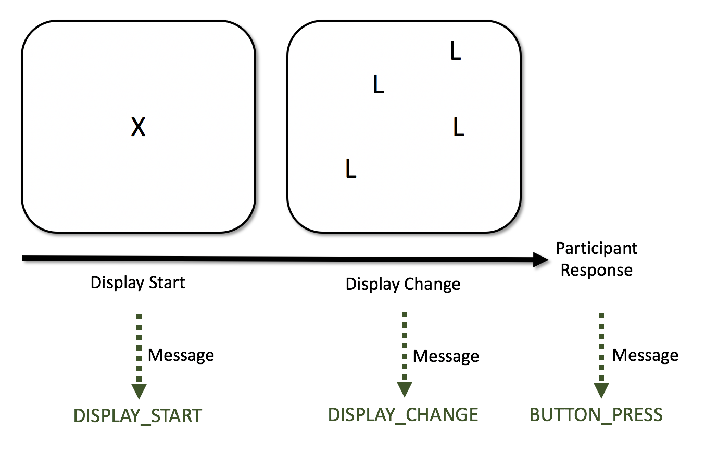
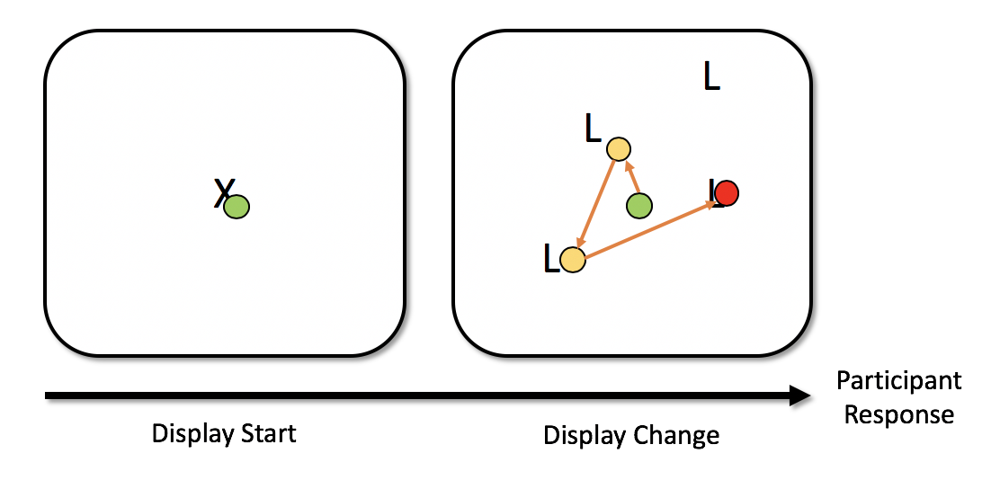
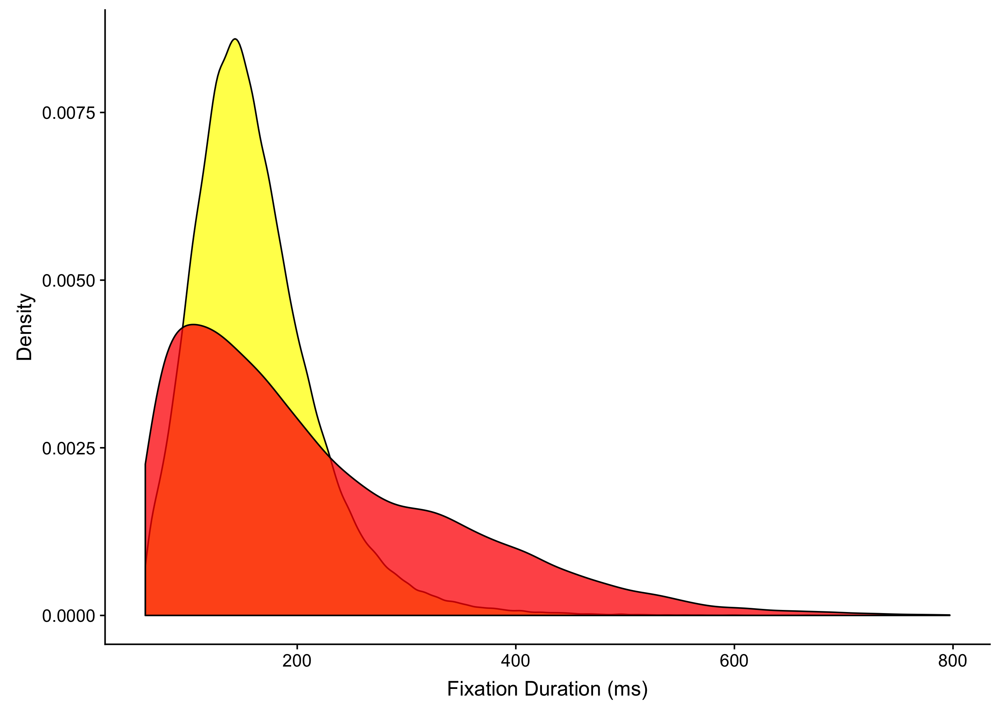
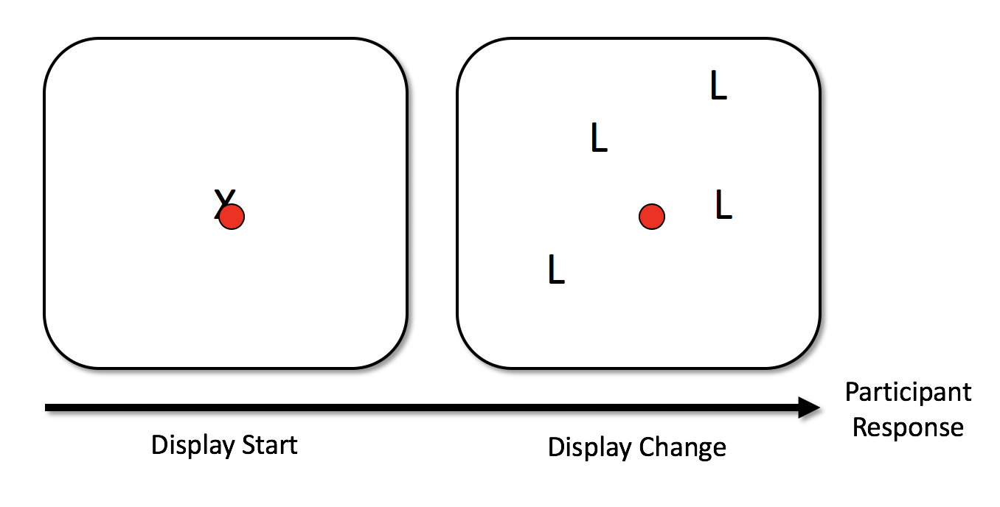
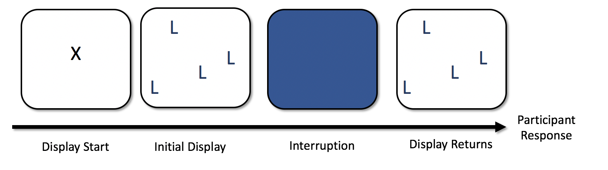

--- 
title: "A Guide to eyeTrackR"
author: "Hayward J. Godwin"
date: "`r Sys.Date()`"
site: bookdown::bookdown_site
output: bookdown::gitbook
documentclass: book
biblio-style: apalike
bibliography: 'book.bib'
link-citations: yes
github-repo: eyeTrackR/bookdown_source
description: "This is a guide to using the eyeTrackR R package."
---


```{r, echo=F}
suppressMessages(library(eyeTrackR))
suppressMessages(library(kableExtra))
```

# eyeTrackR {#index}

EyeTrackR is an R package of functions geared towards analysing eye-tracking datasets. For now, it can handle output from [SR Research's Eyelink eye trackers](https://www.sr-research.com/).

This guide is written to allow you to read through the text in chapter order, and assumes familiarity with the Eyelink system and how to output data from [SR Research DataViewer](https://www.sr-research.com/data-viewer/). The software that you use for data collection can be Experiment Builder, but could also be including E-prime, Matlab, OpenSesame and others.

## What can eyeTrackR do?

EyeTrackR has a wide array of functions available but the core goals for it are speed and accuracy. For speed, it uses the popular [data.table](https://cran.r-project.org/web/packages/data.table/vignettes/datatable-intro.html) R package. For accuracy... well, in some senses that is up to you. Many things can go wrong with complex datasets that are hundreds of thousands of rows in length (indeed, the errors may be sufficiently subtle that it's hard to detect them). The solution to dealing with that, adopted by eyeTrackR, is to implement a number of ways of checking, double-checking and triple-checking your data to make sure that as little as possible slips through the cracks. Many of these checks have been inspired by errors I've caught in my own code, but have also been inspired by requests from editors and reviewers when writing papers.

## Is eyeTrackR for you?

I hope so! I mean, at least, I hope it is useful to you. Every software package or tool is only as useful as it's intended purposes, so I've listed below some different experimental paradigms and whether you might find eyeTrackR useful.

```{r, echo=F}
kable(
  data.table(Paradigm=c('Visual Search', 'Scene Perception', 'Visual World', 'Oculomotor Control (e.g.,   antisaccade tasks)', 'Pupillometry', 
                      'Reading - single line', 'Reading - mutli-line'),
             Recommendation =c('eyeTrackR is for you','eyeTrackR is for you','eyeTrackR is for you', 'eyeTrackR is for you','eyeTrackR is for you, though you will be spending most of your time working on the sample reports rather than the fixation reports.', 'You will want to use the [popEYE](https://github.com/sascha2schroeder/popEye/) R package by Sascha Schroeder for this.', 'You will want to use [popEYE](https://github.com/sascha2schroeder/popEye/) for this as well, but I have used eyeTrackR to examine multi-line text experiments as well.'))
  , booktabs = TRUE, 
  caption = 'Paradigms and recommendations')

```

## Citing eyeTrackR

If you have used eyeTrackR and would like to cite it, please use the following citation:

Godwin, H. J. & Muhl-Rihardson, A. (2019). eyeTrackR: Organising and Analysing Eye-Tracking Data. R package version 1.0.0.

## Some History

I started working on what would become this R package back in 2011 and 2012. Around that time, I was a post-doc, surviving on scraps from different research projects. In order to survive, and because I enjoy coding, I ended up helping out various other people with their R code and eye-tracking datasets. I kept using the same basic scripts repeatedly, as you do, then the scripts became functions, and eventually the functions became eyeTrackR. 

The first version was released around that time - the first commit on github for the package was April 2nd, 2012. I used it extensively since that time, and, because I wasn't sure what it would involve, I never really got around to formalising it and uploading it to CRAN.

In more recent times, I've developed my working practices, and, in the spirit of open science, I wanted to share eyeTrackR in a state that others could use. It seems to me that consistency of data processing, filtering and cleaning methods - all of which are offered by eyeTrackR - could be beneficial to a wider audience. I've seen so many times, and in so many papers, people making mistakes where they've missed things that eyeTrackR can check for them very easily. I'm hoping that it can help to avoid those mistakes in the future. Indeed, I'm sure I've made plenty myself...

## Contributors

I'd like to thank the kind individuals who have taken their time out to contribute to the development and testing of eyeTrackR and/or the development and testing of this guide. At present, the local team of testers and feedback providers are listed below.


```{r, echo=F}
knitr::include_graphics("files/images/hayward.jpg")
``` 
[Hayward Godwin](https://twitter.com/haywardgodwin), who is currently a Lecturer at the University of Southampton. 


```{r, echo=F}

```

[Alexander Muhl-Richardson](https://twitter.com/alexmuhl_r), who is currently a post-doc at Cambridge. Alex has contributed code to eyeTrackR and also made edits to this guide.


```{r, echo=F}
knitr::include_graphics("files/images/andreea.jpeg")
```
Andreea Butnaru, who is currently a PhD student at the University of Southampton. Andreea has made edits and suggestions to this guide.


```{r, echo=F}
knitr::include_graphics("files/images/philippa.jpg")
```
[Philippa Broadbent](https://twitter.com/phillybroadbent), who is currently a PhD student at the University of Southampton. Philippa has made edits and suggestions to this guide.


If you would like to contribute, please do get in touch - more information on this in the next section!

## Get in Touch

Probably the best way to talk to the eyeTrackR team is via the [eyeTrack R Slack channel](http://eyetrackr.slack.com). If you've not heard of Slack, it's a bit like the web forums of antiquity but with a lot more functionality. 

<!--chapter:end:index.Rmd-->


# Installation and Preparation {#installation}

## Installing via CRAN

You can install eyeTrackR via **CRAN** in the same way that you would install most R packages:

```{r, eval=F}
install.packages("eyeTrackR")
```

Alternatively, in RStudio, head over to the **Packages** tab, click **Install** and search for eyeTrackR.

## Installing via Devtools

From R using the **devtools** package:

```{r, eval=F}
library(devtools)
install_github('hjgodwin/eyetrackR/source')
```

## Required Files

To start with, you'll need to output three different types of report from [SR Research DataViewer](https://www.sr-research.com/data-viewer/). You'll need:

* Fixation Report
* Message Report
* Interest Area Report

When I generate these reports, I typically get DataViewer to output every single column of data it can. It has a whole bunch of different ones, but my preference is to be greedy. The simple reason for this is that DataViewer can take a long, long time to load up and output all your data, so you don't want to have to go back into it and do everything again just because you've missed a vital column. That being said, if you have a lower-spec or older computer, or are short on space, you may struggle with these files.

When saving these reports, it's best to save them as tab-delimited text files (.txt).

## Required R Skills

Before using eyeTrackR and the output it provides, you may well want to get familiar with the excellent data.table package. I use that extensively in this guide, so you may want to learn about that first, or in addition to, going through this.

There's a very helpful introduction to using data.table available [here.](https://cran.r-project.org/web/packages/data.table/vignettes/datatable-intro.html)

## Removing eyeTrackR

Please don't!!

Ok, if you want to, either to update it or because you just want to get rid of it, run the following from R:

```{r, eval=F}
remove.packages(pkgs="eyeTrackR")
```


<!--chapter:end:2-installation.Rmd-->


# Functions Overview {#functionsOverview}

## The Basics

The functions in eyeTrackR are mostly split up into two categories: **Organise** functions and **Analyse** functions.^[Future versions may include *OrganiZe* and *AnalyZe* functions, who knows.] 

**Organise** functions are there to help you clean and organise your data. 

**Analyse** functions are there to work out means of common dependent variables and put them together in a format that can easily then be analysed by standard statistical methods (e.g., ANOVAs), as well as visualising those dependent variables.

For most of my projects, I have two key sets of files:

* ORGANISE__markup.R :  this marks up the dataset and cleans it, as you'll see in this chapter.
* ANALYSE__XYZ.R : this either contains all of my analyses (if there aren't that many), OR I split this file up, so that I have one ANALYSE__XYZ.R file for each dependent variable.

Here, I'll begin by giving you an overview of how and why the organise and analyse functions are necessary, and what they do. The remaining chapters involve walkthroughs describing how to use these functions in practice.


## Organise Functions

There are a handful of key tasks that take place in the organise functions. They are as follows:

* Marking up events in each trial.
* Removing outliers or other fixations that you're not interested in.

I'll now talk about each of these in detail before providing a walkthrough of the functions with example code and data.

### Marking up Events

In a typical study, there will be multiple events in a single trial. For example, you might ask participants to fixate a certain point, after which the main display is presented. Then, the participant is given a task of some kind. In the example below, they are given a visual search task wherein they press one button on a response box if they see a T shape, and a different button if no T shapes are present. Their response then terminates the trial. Here's a diagram:

```{r, echo=F}
knitr::include_graphics("files/images/baseTrial.png")
```

Here, we assume that when there is an event or display change of some kind, you send a 'message' to the eye-tracker. These messages are recorded within a fraction of a second of being sent, meaning that they have a high level of temporal accuracy. Let's add another bit of information to the diagram to signify the messages being recorded in the data. These are the bottom row of arrows with text written in green:

```{r, echo=F}

```


For this example, there are three events, and each is recorded with a message in the data:

* Message saying 'DISPLAY_START': Display fixation point.
* Message saying 'DISPLAY_CHANGE': Display a trial. Again, participants here search for a T shape amongst L shapes.
* Message saying 'BUTTON_PRESS': Participant response. They press one button (button XYZ) if they spot a T shape, and a different button (button XYZ) if there are no T shapes present.

Even if you have the most carefully-controlled study, it's unlikely that even the first and second of these events will occur at the same time in each trial. There will be variability when they occur. This means you can't just assume that an event occurred at the same time each trial: you actually have to check the timings for each trial on an individual basis. If you don't do this, in a best-case scenario, you'll be adding noise to your measures, and in a worst-case scenario, your results will be incorrect.

So, the solution is to examine when each event occurred for that participant and for that trial. The functions relating to events and contingencies enable you to do this. What eyeTrackR does for you is gives you full control of how these events, and the different ways they can pan out, can arise. In doing so, it gives you control over which trials and fixations to include or select into your final analyses. The first aspect of this control and organising process is to talk about contingencies.

#### Contingencies

Contingencies enable you to draw together the events in a trial. Imagine our simple example above. A participant may fixate the fixation cross (the green circle in the image below), then make several more during the main trial (the yellow circles in the image below) before making a response (which occurs during the fixation signified by the red circle). Indeed, in most experiments, you would probably hope they would do this^[Or at least, without an eye-tracker, you would assume people do this and behave themselves as you expect.].

```{r, echo=F}

```

In the above example, you have a set of different fixation contingencies occuring. You have:
* Fixation that overlaps the fixation point display and the search display.
* Two fixations that occur during the search display.
* One fixation that overlaps the search display event and the button press event.

Let's add these in to the image, with a coloured bar representing the time periods that the fixations overlap with: 

```{r, echo=F}
knitr::include_graphics("files/images/baseTrialFixesGantt.png")
```

It helps to be selective about which of these you want to include in your analyses. There are many reasons for this, but one of the most important of them is the fact that people have a tendency to hold their fixations while button pressing, thereby creating a substantial jump in the durations of fixations that co-incide with a button press. To give an example, there's a density plot below using the data from a paper of mine [@Godwin2015]. In the yellow you have the fixations that didn't overlap with the button press response, and in the red, you have the fixations that did overlap with button press responses. The means, for what they are worth with such skewed distributions, are 161ms for the fixations that didn't overlap with a response and 215ms for those that did overlap with a response^[I trimmed this down to fixations with a duration of less than 800ms, since there weren't many higher than this. There were also a lot more of the fixations that didn't overlap with a response (about 127,000) than those that did overlap with a response (just under 15,000). This is not surprising given that there is only one response per trial.].

```{r, echo=F}

```

To make things more complex, the situation described above is not the only way that events can unfold during a search trial. On some trials, participants will fixate the fixation point, and hold a fixation throughout the display of the main trial, and then make a response, without making any new fixations, as shown by the red circle in the example below: 

```{r, echo=F}

```

The first point to consider here is that fixations of this type will naturally be longer than when a participant makes multiple fixations around a display - a fixation held throughout a trial will have a longer duration than one which is made right at the end of a trial. The question really is whether participants were actually searching in that trial at all. Trials like this will often be quite short, perhaps because the participant zoned out, perhaps because they could resolve the trial easily. But it helps to know what actually happened so you can again be selective and careful about removing trials where something 'weird' or unexpected happened. 

Having set out just some of the ways that the contigencies can be mapped out, we can now put together a table of contingencies across all of the trials in our example experiment. These contingencies map out the different events that fixations coincide with. A full mapping is shown in the table below.

```{r, echo=F}

fixTable <- data.table(DISPLAY_START =c('X','X','X','' ,'',''),
                       DISPLAY_CHANGE=c('', 'X','X','X','X',''),
                       BUTTON_PRESS  =c('', '', 'X','','X','X'),
                       FIXATION_CONTINGENCY=c('DISPLAY_START','DISPLAY_START__DISPLAY_CHANGE',
                                              'DISPLAY_START__DISPLAY_CHANGE__BUTTON_PRESS',
                                              'DISPLAY_CHANGE','DISPLAY_CHANGE__BUTTON_PRESS',
                                              'BUTTON_PRESS'))

kable(
  fixTable, booktabs = TRUE, 
  caption = 'Fixation contingencies in our example experiment.',
  
)%>%
    kable_styling(bootstrap_options = c("striped", "hover", "condensed", "responsive"), font_size = 9)

```

So this is where the contingencies used by eyeTrackR are helpful. Contingencies were developed to help you work out the various events that occurred during a fixation. They are there to help you make an informed decision about the fixations that you want to include in your analyses. The **contingency** functions add a column to your fixation report, called **FIXATION_CONTINGENCY**. This column tells you what events occurred during the fixation in question. Again, we'll talk more about this in the walkthroughs in the next chapter, but the goal here is to familiarise you with the logic behind all of this.

Let's take some examples in terms of the fixation contingencies. As the table above shows, if a fixation lasted through both a fixation cross and the main trial display, it would have a contingency of FIX_CROSS__MAIN_DISPLAY. If it only lasted through the fixation cross time period, it would have a contingency of FIX_CROSS. Likewise, if the fixation occurred only during the main display, it would have a contingency of MAIN_DISPLAY. 

The nice thing about the way that contingencies work is that they are marked up automatically. All you have to do is tell EyeTrackR the names of the events to consider when labelling the **FIXATION_CONTINGENCY** column. This means that any contingencies which do occur can be detected, and, furthermore, also means that you can be clear about exactly what types of events are occurring during the fixations that you are analysing for your various measures. You can also omit and ignore events that you're not interested in, or events that are there for checking purposes.

## Analyse Functions

The analyse functions in eyeTrackR are there to provide some basic means both for analyses and for visualisations for commonly-analysed measures in eye-tracking. They include:

* Fixation count - mean number of fixations 
* Fix duration - mean fixation duration 
* Total time - mean total fixation time 
* Saccade amplitude - mean saccade amplitude 
* Visit count - mean number of visits to interest areas

For all of the above, you are given a data.table which includes not only the by-trial and by-participant means, but also a table that is ready for plotting (i.e., includes means as well as SDs). All of the above allow you to group your data and aggregate by as many columns as you like.

There are more detailed examples of how this works in practice in the later walkthrough chapters.


<!--chapter:end:3-functionOverview.Rmd-->


```{r, echo=F}
suppressMessages(library(eyeTrackR))
suppressMessages(library(kableExtra))

```

# Organise Functions Walkthrough {#organiseWakthrough}

The walkthrough here assumes you're familiar with the basics of eye-tracking and output from DataViewer.

To make things easier, we have collected all of the R code in this section into one file for you to download and look at, which is available in the [walkthrough.R](https://github.com/hjgodwin/eyeTrackR/blob/master/Walkthroughs/walkthrough.R) file.

## Getting Started

To use events and contingencies, two files will be needed: a fixation report, and a message report. The message report serves as a 'fool-proof' way of examining the timings and occurrences of events.^[If you rely only on the **CURRENT_FIX_MSG_X** columns in the fixation report to determine when event occurs, you wil make errors and fail to detect when events occur (occasionally, and it's very difficult to determine). For that reason, eyeTrackR uses only the message report to determine event timing and occurrences. In fact, I've seen people use only these columns in DataViewer, or worse, guess when events occurred.]

We begin by loading the fixation report and message report - these are the ones that come pre-packaged with EyeTrackR. It's a dummy dataset. You can of course replace them with whatever you want.

```{r, echo=T}
data(fixationreport)
data(messagereport)
```

Next, we begin 'marking up' the events, which is why I usually call the file with my organise functions in ORGANISE__Markup.R. The first step is to replace the spaces in any messages with underscores. This is needed as a safety measure because spaces in the event labels can disrupt the process of working out contingencies.


```{r, echo=T}
# REPLACE SPACES IN MESSAGES
messagereport <- organise.message.replace_spaces(messagereport)

```

## Descriptives

Now, we can get some descriptive statistics from the message report. This is helpful in getting an understanding of what happened in our dataset. It can also be helpful in highlighting any weird issues that have cropped up.

```{r, eval=F}
# TAKE A LOOK
print(organise.message.descriptives(messagereport))

```

From that, we get the following - formatted nicely here for easy reading:

```{r, echo=FALSE}

knitr::kable(
  organise.message.descriptives(messagereport), booktabs = TRUE,
  caption = 'Message report descriptives'
)

```

The table above, which you get in the console output by running **organise.message.descriptives**, has some useful information in it that you can use to spot and diagnose any problems with your data. 

First, it lists all of the messages it finds in your message report file, in turn, and puts them in the **CURRENT_MSG_TEXT** column. Then, it gives you a count of how many times each message has been detected in your message report, the mean time each message occurred from the start of each trial, and then, as well as that, the maximum and minimum times each message occurred. There will always be variability in terms of when events occur in a trial, but this does enable you to make sure that, for the most part at least, things happened when they were supposed to.

One thing you can do at this point is a back-of-the-envelope calculation and check to make sure all the trials are there as you would expect. Assuming you know how many participants were in your dataset, and how many trials, you should be able to check to make sure the right number of trials have started (i.e., had a **DISPLAY_START** message appear). If that's not the case, then you may need to delve deeper to find why data are missing.

Now that you have checked to make sure things appear as they should - here, we have XYZ participants in our example dataset who took part in XYZ trials, giving us XYZ trials across everyone, which is what is being reported in the table, we can continue. 

## Message Markup

Our next step is to begin to **markup** the fixation report file based on the messages we are interested in. As we talked about above, because fixations can span multiple messages or events, we need to get the information on when each message of interest occurred in each trial. The **organise.message.markup** function is the start of that process. Let's run it first then talk about what it does to your fixation report:


```{r, echo=T, eval=F}
# MARKUP FIXATION REPORT
fixationreport <- organise.message.markup(message_df= messagereport, 
                                     fixreport_df = fixationreport, 
                                     message="DISPLAY_START")

fixationreport <- organise.message.markup(message_df= messagereport, 
                                     fixreport_df = fixationreport, 
                                     message="DISPLAY_CHANGE")
```


```{r, echo=F, message=F, results='hide'}
# MARK UP FIXATION REPORT
fixationreport <- organise.message.markup(message_df=messagereport, 
                                     fixreport_df = fixationreport, 
                                     message="DISPLAY_START")

fixationreport <- organise.message.markup(message_df=messagereport, 
                                     fixreport_df = fixationreport, 
                                     message="DISPLAY_CHANGE")
```

If you now take a look at **fixationreport** - which I would recommend you do - you'll now see some new columns have been added. One is called **DISPLAY_START** and the other is called **DISPLAY_CHANGE**. If you look closely, what this has done is^[In SQL parlance, it's a simple join, of course.]:

* Work out when each **DISPLAY_START** and **DISPLAY_CHANGE** occurred in each of the trials.
* Take the timings of those messages and then add that information to the fixation report.

This process also gives you some diagnostic information that helps to check for any problems. It compares the number of rows your fixation report had before you marked it up with each new message with what happens to the fixation report after you have marked it up with each new message. If the number of rows are different, that suggests something has gone wrong. Usually this is the case that you have got participants or trials that are missing from either the fixation report or the message report. If you get the following message, then you have nothing to worry about because the dataset has been matched up perfectly:

> Difference between input and output rows: 0

### Behavioural Markup

We now have two of the major events in each trial marked up into our fixation report. The only thing that is missing is the other main event in each trial: the response made by each participant!

Here, there are two ways to markup the fixation report. If you use a button box, you can use the method here. If you are not using a button box, you'll need to use the method described in [Behavioural Markup (Alternative)](#bma).

To mark up the fixation report with the timings of each response, as well as the button press of each response, and finally the outcome (correct or incorrect) of each response, we can use **organise.responses.markup**. This function needs to be fed the fixation report you are using, as well as the column which states what the correct response on each trial is. Here, since the button boxes you can connect to Experiment Builder get given numbers (1-8), the correct response lists the correct numerical value of the button that needs to be pressed on each trial. Let's run the code:

```{r, eval=F}
# NOW DO ACCURACY AND RT MARKUP
fixationreport <- data.table(organise.responses.markup(fixationreport, "CORRECT_RESPONSE"))
```

```{r, echo=F, message=F, results='hide'}
# NOW DO ACCURACY AND RT MARKUP
fixationreport <- organise.responses.markup(fixationreport, "CORRECT_RESPONSE")
```

This function has added the following columns to your fixation report file:

* BUTTON_NUMBER - the button number pressed on that trial.
* OUTCOME - the outcome ('CORRECT' or 'INCORRECT' of the response).
* RESPONSE_TIME - the time from the start of the trial that the response was made.

It's worth noting that RESPONSE_TIME isn't necessarily what you want to use as your Reaction Time measure, since, with this experiment, as in many others, the display doesn't actually appear for people to look at until DISPLAY_CHANGE. We'll talk more about this later.

### Behavioural Markup (Alternative) {#bma}

If your participants didn't use a standard button box, then you need to use a slightly different approach. This is the case if participants responded using a keyboard or a mouse. There are other ways to achieve this, but here is what I would recommend to go for since the approach suggested below fits in with the expected inputs and outputs of other functions that form part of eyeTrackR.

To begin with, what we need to have is a message sent to the message report detailing two things: the time of the response, and the response itself. Suppose that participants here are asked to press the Z key for one response to indicate that they have found a target and the M key for a second response to indicate that they think no targets are present. I would recommend that you set up your experiment software so that when the participants press the Z key, it sends a message at the same time saying 'RESPONSE_PRESENT' and so that when participants press the M key, it sends a message at the same time saying 'RESPONSE_ABSENT'. This can be acheived in Experiment Builder by creating two keyboard triggers, one for Z and one for M, and setting them up to send the appropriate RESPONSE_PRESENT or RESPONSE_ABSENT message the moment the keyboard is pressed. That way, you'll get messages sent at the right time (the moment the keyboard is pressed) and with the right information.

Now, if you do this, you'll get either a RESPONSE_PRESENT or RESPONSE_ABSENT message appearing in each trial. You'll also have the responses logged directly into the message report. To work with this approach, rather than using organise.responses.markup as in the above example that focused on button boxes, you need instead to mark up trials as follows:

```{r, eval=F}
fixationreport <- organise.message.markup(message_df=messagereport, 
                                          fixreport_df = fixationreport, message="KEYBOARD_PRESENT")
fixationreport <- organise.message.markup(message_df=messagereport, 
                                          fixreport_df = fixationreport, message="KEYBOARD_ABSENT")
```

By doing so, you'll end up with two new columns in fixationreport. One will say KEYBOARD_PRESENT, and the other will say KEYBOARD_ABSENT. These will represent the time at which participants pressed either the Z key or the M key.

The final steps are to mimic the function of organise.responses.markup by using the code below. This creates a RESPONSE column and sets it to 'PRESENT' when the KEYBOARD_PRESENT column is not set to NA. The KEYBOARD_PRESENT column is not set to NA on trials where the present key was pressed. It then does the same for the KEYBOARD_ABSENT column and absent responses. Next, it creates the OUTCOME column and sets this to 'CORRECT' on trials where the RESPONSE column matches the PRESENCE column. Here, we're assuming that PRESENCE says either 'PRESENT' or 'ABSENT', representing the two trial types. Finally, it sets the RESPONSE_TIME column which organise.responses.markup would normally have set up.

```{r, eval=F}

# HERE WE ASSUME THAT fixationreport IS A data.table
# WE ALSO ASSUME THAT PRESENCE LISTS 'PRESENT' OR 'ABSENT' DEPENDING ON THE
# TRIAL TYPE

fixationreport[is.na(KEYBOARD_PRESENT)==F,RESPONSE:='PRESENT',]
fixationreport[is.na(KEYBOARD_ABSENT)==F,RESPONSE:='ABSENT',]

fixationreport[PRESENCE==RESPONSE,OUTCOME:='CORRECT',]
fixationreport[PRESENCE!=RESPONSE,OUTCOME:='INCORRECT',]

fixationreport[is.na(KEYBOARD_ABSENT)==F,RESPONSE_TIME:=KEYBOARD_ABSENT,]
fixationreport[is.na(KEYBOARD_PRESENT)==F,RESPONSE_TIME:=KEYBOARD_PRESENT,]

```


## Fixation Contingencies

We now know at what point in each trial each of the three major events occurred- the DISPLAY_START events, the DISPLAY_CHANGE events, and the RESPONSE_TIME events. We know what button participants pressed, and we know if they were right or wrong in each trial. The final step now is to markup the fixation **contingencies**. Again, these are important in helping us be sure that we've included what we want to include when it comes to analysing our eye-tracking data.

To get going with this, we need to use the **organise.message.fix_contingencies** function. You need to feed this function the fixation report you're using, as well as a list of the messages you want to mark up in terms of your contingencies. Note that you don't need to include all the messages here, just the ones you're interested in. Let's run it as follows:

```{r, results='hide'}
# NOW MARK UP FIXATION CONTINGENCIES
fixationreport<-organise.message.fix_contingencies(fixationreport, 
                                              list("DISPLAY_START", 
                                                   "DISPLAY_CHANGE", 
                                                   "RESPONSE_TIME"))
```

If you now look at your fixation report, a bunch of new columns have been added to it. They are as follows:

* WITHIN_PRE_DISPLAY_START - this lets you know if a given fixation started before the first message you were interested in. In this case, the first message we were interested in is DISPLAY__START, so this column is helpful in letting us focus in on fixations that occurred before even the fixation cross came up. You might be wondering how there can possibly be any time before the fixation cross which literally starts the trial, but in fact, the eye-tracker actually turns on for a _little while_ before the display comes up. Any fixation labelled as TRUE under WITHIN_PRE_DISPLAY_START began before the fixation cross came up.

* WITHIN_DISPLAY_START - this lets you know if a given fixation was occuring when the DISPLAY_START message came up. The cells say TRUE if that is the case and FALSE if not.

* WITHIN_DISPLAY_CHANGE - this lets you know if a given fixation was occuring when the DISPLAY_CHANGE message came up. The cells say TRUE if that is the case and FALSE if not.

* WITHIN_RESPONSE_TIME - this lets you know if a given fixation was occuring when the RESPONSE_TIME message came up. The cells say TRUE if that is the case and FALSE if not.

* FIXATION_CONTINGENCY - this is the most important column added by the **organise.message.fix_contingencies** function. It pastes together all of the message names that each fixation spanned. 

Let's give some more detailed examples of how to interepret the important FIXATION_CONTINGENCY column. It'll help if we begin by looking at the final columns of the fixation report after **organise.message.fix_contingencies** has been run:

```{r, echo=FALSE,createtable}
knitr::kable(
  fixationreport[1:9,27:31], booktabs = TRUE, 
  caption = 'Fixation report final columns'
)%>%
    kable_styling(bootstrap_options = c("striped", "hover", "condensed", "responsive"), font_size = 9)
```

Browsing through these, you may have already worked out what FIXATION_CONTINGENCY really does. Let's give some examples:

* The fixation in the first row began before DISPLAY_START and then ended during the period of time when the fixation cross was up. For that reason it gets a contingency of PRE_DISPLAY_START__DISPLAY_START.

* The fixation in the second row began when the fixation cross was up, and ended when the fixation cross was up, giving it a contingency of DISPLAY_START.

* The fixation in the third row began when the fixation cross was up, and ended when the main search array was visible. For that reason, it gets a contingency of DISPLAY_START__DISPLAY_CHANGE.

* The next five fixations began and ended when the search array was visible, so they get a contingency of DISPLAY_CHANGE.

* The final fixation began when the search array was visible, and ended when the response was made. For that reason, this fixation gets a contingency of DISPLAY_CHANGE____RESPONSE_TIME.

With the fixation report marked up in this manner, you can then, at a later point, be careful in how you select your data down to focus only on the trials and/or fixations that you are definitely interested in.

## Behavioural Data

You already have the responses, outcomes and reaction times marked up for each trial at this point. But one problem is that these will require some work to convert to, say, mean accuracy rates. This is because the fixation report has one row per fixation, rather than one row per trial. Therefore, if you want the mean accuracy rate for your participants, you'll need to crunch the data down to one row per trial before computing your means.

Fortunately, eyeTrackR can do this for you!  Our first step in doing this is to work out the **TRUE_RT** column. This is as follows:

```{r}
# SET UP TRUE RT
fixationreport[,TRUE_RT := RESPONSE_TIME-DISPLAY_START,]
```

This subtracts the display start time from the response time, to enable us to focus just on the time that we are interested in. 

Next, you just need to run **analyse.behavioural.data**, feed it the fixation report, and the list of columns you want to aggregate by (using the **aggregation_column_list** input). Here, in the example below, the output is saved to the behaviouralData data.table.

```{r, eval=F}
behaviouralData <- analyse.behavioural.data(fixationreport, 
                                                aggregation_column_list = list('TRIALTYPE_TEXT'))

```

The **behaviouralData** table looks like this:

```{r, eval=T, echo=F}
knitr::kable(
  behaviouralData <- analyse.behavioural.data(fixationreport, aggregation_column_list = list('TRIALTYPE_TEXT')), booktabs = TRUE, 
  caption = 'Summarised Behavioural Data'
)%>%
    kable_styling(bootstrap_options = c("striped", "hover", "condensed", "responsive"), font_size = 10)

```

Note a few useful columns in that table to help you back-calculate and double-check to make sure everything is going ok. You should look through this to be certain. Is there the right number of trials? The right number of participants? Does it look like anything is missing? Has the accuracy rate been calculated properly? Also, do the reaction times make sense?

Again, the goal here is to help you be certain that there are no problems with your data and catch those problems as early as possible.

## Final Checks

We are almost ready to save our marked-up fixation report. It's worth at this point to suggest running some checks on our data. Have a go at running the **organise.checks.random_trial** function. This is a simple one - the function does, in fact, do nothing at all to your code. All it does it pick, from a random trial and participant, the fixations from that trial and display them in the console for you. You can repeatedly run this function to inspect all sorts of trials to make sure that any code you have run on your data makes sense and has worked how you think it should have done. 

```{r, eval=F}
# RANDOM TRIAL TO CHECK THINGS OUT
print(organise.checks.random_trial(fixationreport))
```

I can't tell you the number of times I have thought things were working as they should, but then this function has shown me the error of my ways! This is particularly worth running multiple times for eye-tracking datasets since they can often be huge (hundreds of thousands of fixations), making it virtually impossible to conduct a visual inspection of everything.

Next, we can get descriptive and summary statistics of the contingencies. Here's what we have for our current fixationreport:

``` {r, eval=F}
# FIX CONTINGENCIES
print(organise.contingencies.descriptives(fixationreport))
```

That will give a table that looks like this:

```{r, eval=T, echo=F}
knitr::kable(
  organise.contingencies.descriptives(fixationreport), booktabs = TRUE, 
  caption = 'Descriptives for Fixation Contingencies'
)%>%
    kable_styling(bootstrap_options = c("striped", "hover", "condensed", "responsive"), font_size = 10)

```

It tells you how many instances of each fixation contingency have been found. It also tells you how many fixations haven't been set to a contingency. If you see a row that says 'UNCLASSIFIED', this is the count of fixations that have not had a contingency assigned to them.

## Removing Trials

Our final steps focus on cleaning the dataset. We do this in two ways:
* We remove trials that missed important events, such as display changes or responses
* We remove fixations that were outliers, i.e., those that were too long or too short

Ideally, the first step of this process should remove zero trials for the simple reason that, in most experiments, we should have the same series of events in each trial. Again, this serves as a health check of our dataset to ensure that everything has worked as it should. 

### Removing Trials with Missing Events

Let's begin with the first of our steps in terms of cleaning - removing trials that missed important events. Here, we want to make sure we remove all the trials that lacked the DISPLAY_CHANGE or RESPONSE_TIME messages.

``` {r, eval=F}
# REMOVE TRIALS THAT LACKED A DISPLAY CHANGE AND/OR A RESPONSE TIME
messageRemovals <- organise.message.removals(fixreport_df=fixationreport, 
    required_message_list=list("DISPLAY_CHANGE", "RESPONSE_TIME"))

# LOOK AT MESSAGE REMOVALS
print(messageRemovals[[1]])

# GRAB THE FIXATION REPORT WITH TRIALS REMOVED
fixMessagesRemoved <- messageRemovals[[2]]

# THIS SHOWS WE HAVE NO UNCLASSIFIED FIXATIONS, GOOD!
print(organise.contingencies.descriptives(fixMessagesRemoved))
```

In the above code, *messageRemovals* is a list of data.tables. The first item in the list, accessed using *messageRemovals[[1]]*, gives you details information regarding how many trials, and what percentage of trials was removed for each participant, and why. The second item in the list, accessed using *messageRemovals[[2]]* is the fixation report data.table which has had all the trials where the specified events of DISPLAY_CHANGE and RESPONSE_TIME didn't occur removed.

As you can see from *messageRemovals[[1]]*, no trials have been removed because everything happened as it should. Here is what that looks like:

```{r, eval=T, echo=F}

messageRemovals <- organise.message.removals(fixreport_df=fixationreport, 
    required_message_list=list("DISPLAY_CHANGE", "RESPONSE_TIME"))

# GRAB THE FIXATION REPORT WITH TRIALS REMOVED
fixMessagesRemoved <- messageRemovals[[2]]

knitr::kable(
  messageRemovals[[1]], booktabs = TRUE, 
  caption = 'Message Removals Summary Table'
)%>%
    kable_styling(bootstrap_options = c("striped", "hover", "condensed", "responsive"), font_size = 8)

```

### Removing Outlier Fixations

Our final step of the cleaning process is to remove fixations that were too long or too short. The convention I use, and the default set by eyeTrackR, is to remove fixations that were less than 60ms or greater than 1200ms in duration^[I know I know, outlier limits can be so arbitrary but I'm actually working on a review of the data pipelines in search studies in this regard with a view to getting a better handle on this. Please bear with me.].

The approach here is very similar to that above. We use *organise.exclusions.fix_durations*, and feed it a fixation report. Here we are giving it the fixation report after cleaning trials that lacked certain messages. Here's the code:


```{r}
# REMOVALS BASED ON FIXATION DURATIONS
durationRemovals <- organise.exclusions.fix_durations(fixreport_df=fixMessagesRemoved)

# SUMMARY STATS OF HOW MANY FIXATIONS REMOVED PER PARTICIPANT
durationsRemoved <- durationRemovals[[1]]

# FINAL DATASET WHICH CAN BE ANALYSED 
finalDT <- durationRemovals [[2]]
```

In the above example you can take a look at *durationsRemoved* to get a handle on how many fixations were removed from your fixation report, at a participant level. This can be useful in spotting problems with certain participants or datasets. Let's take a quick look:

``` {r, echo=F}

knitr::kable(
  durationsRemoved, booktabs = TRUE, 
  caption = 'Fixation Removals Summary Table'
)%>%
    kable_styling(bootstrap_options = c("striped", "hover", "condensed", "responsive"), font_size = 8)

```

Finally, though, *finalDT* is the marked up and cleaned dataset that is ready for analysis.

## Time to Save

The last step is to save the data.table for later analyses. Here's an example:

``` {r, eval=F}
# THAT'S IT! LET'S NOW SAVE THE FINAL THING ##########################################################
write.table(finalDT, "finalDT.txt", row.names=FALSE)

```
 
## Putting it Together

I'll close with one last example from a different, and, in fact, real, experiment [@Godwin2013]. I'm going to include this to provide an example of why the organise functions can be so useful.

Let's turn back the clock to some time around 2009. At that point, I was trying to learn eye-tracking. I started working under the expert guidance of the legendary Val Benson and equally legendary Denis Drieghe on a set of experiments that really shouldn't have been anyone's first attempt at eye-tracking. There were display changes that needed to be programmed and fine-tuned, trial and fixation filtering to work out, and much more.

I initially was interested in looking at how getting distracted from a visual search interrupts people - specifically, I was keen to know if, after stopping a search and getting distracted by a secondary task, people would pick up where they left off, or start their searches again from scratch. But I was getting ahead of myself, and so we settled on what was effectively a control condition where there was no secondary task, and just a blank-screened interruption (much like visual world paradigm research, for a review see: [@FERREIRA2008405]).

The basic trial sequence was as follows:


```{r, echo=F}

```


People started searching, and then, after a random delay of between 1200 and 1400 ms, the display disappeared. We wanted to make sure that the display disappeared during a saccade, so had to be very careful about which trials to include in our analyses. The scripts and code I used to process and filter the data formed the first, somewhat primordial, version of eyeTrackR.^[I tried to tidy it up and make it usable, but didn't get far, though it exists as [Inpsyte Data Analysis](https://github.com/hjgodwin/Inpsyte-Data-Analysis). It was done in a combination of PHP and MySQL, if you can believe it, at least at first. This was partly because I didn't know R all that well at the time, and also because I needed to visualise the trials to make sure that I was processing and filtering things properly, and I knew how to whip up images quickly using web langauges. That experience taught me a great deal, especially about how important it was to check, check and check again to make sure your code and processing scripts are doing what you think they are doing.]

Ultimately, what I ended up putting together was the need to do the following:
- Filter out trials with an incorrect response
- Remove trials where the interruption was 'seen' by participants - in other words, when the display disappeared during a fixation
- Filter out trials where the interruption didn't occur even though it was supposed to. In these trials, participants responded before the interruption could occur
- Filter out fixations that were < 60ms in duration
- Filter out any fixations that spanned different display types

This was all necessary to ensure that we analysed a pure and uncontaminated set of fixations that occurred during the interruption only. What we ended up finding was that, even when the display was removed from view, people could keep searching the display, albeit only for a few fixations.

Hopefully that provides you with at least some of the details and considerations that need to go into ensuring that your dataset is properly prepared and ready for your analyses. 

<!--chapter:end:4-organiseWalkthrough.Rmd-->


# Analyse Functions Walkthrough {#analyseWakthrough}

The walkthrough here assumes you're familiar with the basics of eye-tracking and output from DataViewer, and also assumes you've gone through the previous section on the organise functions as well.

The analyse functions are more indpendent from one another than the organise functions, so this section is going to be much briefer. Unlike the organise functions, the analyse functions can be run in any order you want, and of course, don't have to be run if you aren't interested in the dependent variables that they calculate for you.

For the most part, these are intended as generic helper functions, and your own analyses may well end up being much more specific. The good news, however, is that these functions are built on the same basic input and output structure, so we'll start with what that is to give us a foundation.

## Input Structure

The analyse functions all have the same basic structure, which is:

```{r, eval=F}
analyse.X.X(fixreport_df, 
            aggregation_column_list = c(),
            spss = FALSE, 
            prefixLabel = "")
```

That's the basic structure of the functions. Let's go through the components:

* fixreport_df is the name of your input fixation report
* aggregation_column_list is a list of columns that you want to group/aggregate your data by, such as TRIALTYPE_TEXT in our example fixation report that we've been working on
* spss can be set to TRUE or FALSE. By default its set to FALSE. If you set it to TRUE, it will return the output in a wide format, ready for SPSS (see [here](https://www.theanalysisfactor.com/wide-and-long-data/) for more info). 
* prefixLabel is only needed in some rare cases so I would avoid doing anything with it.

The simple summary we can give here is that, to use any of the analyse functions, you need to give the functions a fixation report, and then tell the functions which columns to group or aggregate the data by. Let's move on to what the analyse functions give back to you when you've run them.

## Output Structure

To talk about what each analyse function gives you, let's look at one example - here, we're using the analyse.fix.count function, which gives us the mean number of fixations per trial.

``` {r}
fixCounts <- analyse.fix.count(fixationreport, 
                               aggregation_column_list = list('TRIALTYPE_TEXT'))
```

If you look at fixCounts, you'll see this is actually a list of three data.tables. They are as follows:

* First, there is fixCounts$byTrial. This is a data.table of the fixation count for every trial, broken down for each participant, and also by the aggregation_column_list variables
* Next, there is fixCounts$byppt. This is a data.table of the mean fixation count for every participant, and also by the aggregation_column_list variables
* Finally, there is fixCounts$graphs. This is a data.table of the mean fixation count for the different aggregation_column_list variables

Let's inspect each on in turn now. First, fixCounts$byTrial - this should be pretty self-explanatory:

```{r, echo=F}
knitr::kable(
  head(fixCounts$byTrial), booktabs = TRUE, 
  caption = 'fixCounts$byTrial - first handful of rows only'
)%>%
    kable_styling(bootstrap_options = c("striped", "hover", "condensed", "responsive"), font_size = 9)
```

Next is fixCounts$byppt - again, this is the same thing except now it's averaged by participant and by the aggregation_column_list columns only:

```{r, echo=F}
knitr::kable(
  head(fixCounts$byppt), booktabs = TRUE, 
  caption = 'fixCounts$byppt - first handful of rows only'
)%>%
    kable_styling(bootstrap_options = c("striped", "hover", "condensed", "responsive"), font_size = 9)
```

Finally is fixCounts$graphs, which provide means and SEs ready for putting into graphs:

```{r, echo=F}
knitr::kable(
  fixCounts$graphs, booktabs = TRUE, 
  caption = 'Fixation report final columns'
)%>%
    kable_styling(bootstrap_options = c("striped", "hover", "condensed", "responsive"), font_size = 9)
```

Let's get an example graph put together. My preference is to use ggplot2 in combination with the cowplot package for ready-made APA formatting:

```{r}
library(ggplot2)
library(cowplot)

ggplot(fixCounts$graphs)+
  aes(x=TRIALTYPE_TEXT, y=AVERAGE)+
  geom_point(size=2)+
  scale_y_continuous('Mean Fixation Count')+
  scale_x_discrete('Trialtype Text')+
  geom_errorbar(aes(ymin=AVERAGE-SE, ymax=AVERAGE+SE), width=0.1)

```

## Understanding the Analyse Approach

You might be thinking to yourself something along the lines of 'hey, how come we get by-trial and then by-participant means?' The answer to this is simple: it's how I put my means together. I'll be honest here and say that when I first started learning eye-tracking, taking the mean of some means seemed weird to me. How come it's best to take a by-trial mean followed by a by-participant mean?

To explain this more clearly, let's look at a different measure such as fixation durations. If we simply took the mean of the CURRENT_FIX_DURATION column in our fixation report, why isn't that going to give us the correct mean? The simple answer is that, if you do things in that manner, then you're going to have a very imbalanced mean come out from your calculations. This is because some trials have more fixations than others - sometimes, many more fixations. As a consequence, if you don't average down to the by-trial means first, you'll be allowing the trials with a lot of fixations to contribute more to the final mean than those with only a few fixations. By calculating the by-trial means first, you permit each trial to contribute equally to the final mean that goes into your analyses.

In addition, this sort of issue is made more pressing by the existence of coarse-to-fine effects in eye movement behaviour, which have mostly been studied in visual search tasks [@Godwin2014a; @Over2007]. As a trial goes on, fixations tend to get longer in duration while saccades get shorter - hence the term 'coarse-to-fine': at the start of a trial, fixations are short and dispersed (coarse), but towards the end of a trial, fixations are longer and closer together (fine). Again, a consequence of this is that it could lead to an imbalance in your means if you don't take the by-trial means first.

## Participants

By default, the analyse functions, as you may have seen, group your data in terms of a column called RECORDING_SESSION_LABEL. This column refers to the session name if you use Experiment Builder. Usually, this one is unique for each participant, which is why the analyse functions automatically assume that RECORDING_SESSION_LABEL is unique for each participant. If you participants took part in more than one session, you'll need to re-organise your data before feeding the data to these functions.

## List of Analyse Functions

Here is a list of the analyse functions currently available:

* Fixation count - mean number of fixations 
* Fix duration - mean fixation duration 
* Total time - mean total fixation time 
* Saccade amplitude - mean saccade amplitude 
* Visit count - mean number of visits to interest areas


<!--chapter:end:5-analyseWalkthrough.Rmd-->

