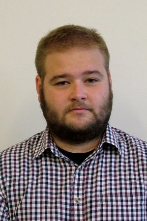

--- 
title: "A Guide to eyeTrackR"
author: "Hayward J. Godwin"
date: "`r Sys.Date()`"
site: bookdown::bookdown_site
output: bookdown::gitbook
documentclass: book
biblio-style: apalike
bibliography: 'book.bib'
link-citations: yes
github-repo: "hjgodwin/eyeTrackR/bookdown_source/"
description: "This is a guide to using the eyeTrackR R package."
editor_options: 
  chunk_output_type: console
---


```{r, echo=F}
suppressMessages(library(eyeTrackR))
suppressMessages(library(kableExtra))
```

# eyeTrackR {#index}

Welcome! So, eyeTrackR is an R package of functions geared towards analysing eye-tracking datasets. For now, it can handle output from [SR Research's Eyelink eye trackers](https://www.sr-research.com/).

This guide is written to allow you to read through the text in chapter order, and assumes familiarity with the Eyelink system and how to output data from [SR Research DataViewer](https://www.sr-research.com/data-viewer/). The software that you use for data collection can be Experiment Builder, but could also be including E-prime, Matlab, OpenSesame and others.

## What can eyeTrackR do?

EyeTrackR has a wide array of functions available but the core goals for it are speed and accuracy. For speed, it uses the popular [data.table](https://cran.r-project.org/web/packages/data.table/vignettes/datatable-intro.html) R package. For accuracy... well, in some senses that is up to you. Many things can go wrong with complex datasets that are hundreds of thousands of rows in length (indeed, the errors may be sufficiently subtle that it's hard to detect them). The solution to dealing with that, adopted by eyeTrackR, is to implement a number of ways of checking, double-checking and triple-checking your data to make sure that as little as possible slips through the cracks. Many of these checks have been inspired by errors I've caught in my own code, but have also been inspired by requests from editors and reviewers when writing papers.

## Is eyeTrackR for you?

I hope so! I mean, at least, I hope it is useful to you. Every software package or tool is only as useful as it's intended purposes, so I've listed below some different experimental paradigms and whether you might find eyeTrackR useful.

```{r, echo=F}
kable(
  data.table(Paradigm=c('Visual Search', 'Scene Perception', 'Visual World', 'Oculomotor Control (e.g.,   antisaccade tasks)', 'Pupillometry', 
                      'Reading - single line', 'Reading - mutli-line'),
             Recommendation =c('eyeTrackR is for you','eyeTrackR is for you','eyeTrackR is for you', 'eyeTrackR is for you','eyeTrackR is for you, though you will be spending most of your time working on the sample reports rather than the fixation reports.', 'You will want to use the [popEYE](https://github.com/sascha2schroeder/popEye/) R package by Sascha Schroeder for this.', 'You will want to use [popEYE](https://github.com/sascha2schroeder/popEye/) for this as well, but I have used eyeTrackR to examine multi-line text experiments as well.'))
  , booktabs = TRUE, 
  caption = 'Paradigms and recommendations')

```

## Citing eyeTrackR

If you have used eyeTrackR and would like to cite it, please use the following citation:

Godwin, H. J. & Muhl-Rihardson, A. (2019). eyeTrackR: Organising and Analysing Eye-Tracking Data. R package version 1.0.0.

## Some History

I started working on what would become this R package back in 2011 and 2012. Around that time, I was a post-doc, surviving on scraps from different research projects. In order to survive, and because I enjoy coding, I ended up helping out various other people with their R code and eye-tracking datasets. I kept using the same basic scripts repeatedly, as you do, then the scripts became functions, and eventually the functions became eyeTrackR. 

The first version was released around that time - the first commit on github for the package was April 2nd, 2012. I used it extensively since that time, and, because I wasn't sure what it would involve, I never really got around to formalising it and uploading it to CRAN.

In more recent times, I've developed my working practices, and, in the spirit of open science, I wanted to share eyeTrackR in a state that others could use. It seems to me that consistency of data processing, filtering and cleaning methods - all of which are offered by eyeTrackR - could be beneficial to a wider audience. I've seen so many times, and in so many papers, people making mistakes where they've missed things that eyeTrackR can check for them very easily. I'm hoping that it can help to avoid those mistakes in the future. Indeed, I'm sure I've made plenty myself...

## Contributors

I'd like to thank the kind individuals who have taken their time out to contribute to the development and testing of eyeTrackR and/or the development and testing of this guide. At present, the local team of testers and feedback providers are listed below.

```{r, echo=F, out.width='50%'}
knitr::include_graphics("files/images/hayward.jpg")
``` 

  
[Hayward Godwin](https://twitter.com/haywardgodwin), who is currently a Lecturer at the University of Southampton. 


```{r, echo=F}

```
  
[Alexander Muhl-Richardson](https://twitter.com/alexmuhl_r), who is currently a post-doc at Cambridge. Alex has contributed code to eyeTrackR and also made edits to this guide.


```{r, echo=F, out.width='50%'}

```
  
Andreea Butnaru, who is currently a PhD student at the University of Southampton. Andreea has made edits and suggestions to this guide.


```{r, echo=F, out.width='50%'}

```
  
[Philippa Broadbent](https://twitter.com/phillybroadbent), who is currently a PhD student at the University of Southampton. Philippa has made edits and suggestions to this guide.

If you would like to contribute, please do get in touch - more information on this in the next section!

## Get in Touch

Probably the best way to talk to the eyeTrackR team is via the [eyeTrack R Slack channel](https://join.slack.com/t/eyetrackr/shared_invite/enQtODQyNDQzMzkxNTc1LWM4MmUyMTJmYTA4ZjgzNWNjNGQxNzcxYWY1NWNhYzM2ODg1OWNiNDg4MzIxYWZmZjkwZWFjMTU0MmU4NDE5Y2Y). If you've not heard of Slack, it's a bit like the web forums of antiquity but with a lot more functionality. 
